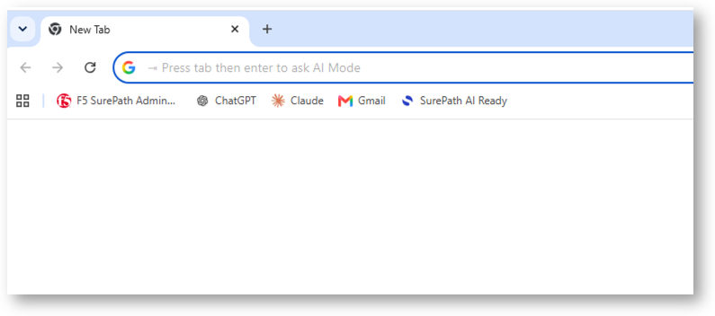

Connect to the Client and discover the tools
============================================

The Windows 11 machine has several tools already installed and configured

* Google Chrome
* Claude Desktop
* A MCP Server

Login to win 11 RDP
-------------------

* login : ``user``
* password : ``user``

.. note:: A powershell script automatically runs on the first login to install and configure the Proxy settigns (PAC file, user authentication ...). 
   
   You can notice a custom email address set just for your session.

   .. image:: ../../pictures/powershell.png

Open Chrome
-----------

You can find several bookmarks

* Surepath AI Ready - check demo status
* F5 SurePath Admin Portal - READ ONLY access to the F5 AI Security Platform Portal
* ChatGPT, Claude and GMAIL

.. note:: SSO is enabled for all links, no need to enter any credentials.

.. warning:: **Accounts to log-in in the services.**
   
   If ChatGPT or Claude are disconnected, select Google Auth and choose the account already saved in Chrome (fdemo2026@gmail.com)
   
   If Surepath.ai Admin Portal is disconnected, enter **admin-ro@f5access.onmicrosoft.com**, then SSO with Entra ID. No password required.

