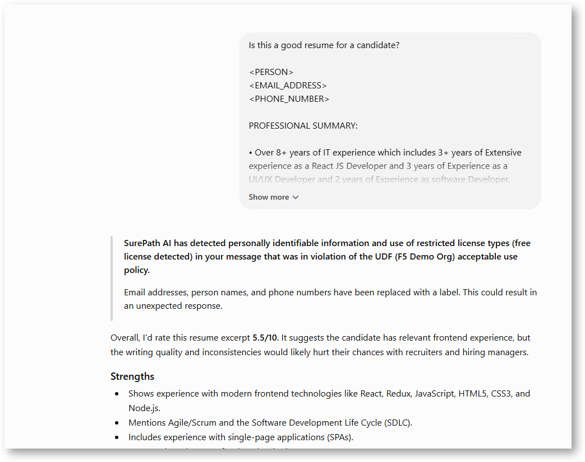

Send several prompts
====================

Send these prompts to ChatGPT or Claude
---------------------------------------

Send the prompts below to ChatGPT or/and Claude. Notice the Surepath.ai blocking or masking actions on the client side. You can see the results in real time.

Marketing data redaction on ChatGPT
~~~~~~~~~~~~~~~~~~~~~~~~~~~~~~~~~~~

.. code-block:: text

   Create a campaign brief for my customer contact that will help launch a new athletic clothing line.

   John Smith
   john.smith100@nike.com
   406-212-1234
   Campaign Brief: "Fast Threads of Tomorrow" Global Launch

   Product:New sustainable streetwear collection

   Target Audience:Gen Z and Millennial fashion-forward consumers (18-35)

   Campaign Duration:3 months

   Budget:$2.5M global

   Campaign Objective
   Launch our eco-conscious streetwear line across 15 markets, achieving 25% brand awareness increase and driving 40% of Q4 revenue through this collection.

   Key Messages

   - "Style meets sustainability"
   - "Express yourself while protecting tomorrow"
   - "Fashion that fits your values"

   Creative Direction

   - Visual Style:Urban, vibrant, authentic street photography
   - Tone:Confident, inclusive, environmentally conscious
   - Hashtag:#ThreadsOfTomorrow

   Channel Strategy

   - Digital:Instagram/TikTok campaigns, influencer partnerships
   - Traditional:Transit advertising in major cities, pop-up experiences
   - Retail:In-store displays, QR codes linking to sustainability story

   Success Metrics

   - Social engagement rate: +150%
   - Website traffic: +200%
   - Conversion rate: 8%
   - Sustainability message recall: 60%

Data redaction on an approved service using ChatGPT
~~~~~~~~~~~~~~~~~~~~~~~~~~~~~~~~~~~~~~~~~~~~~~~~~~~

.. code-block:: text

   Is this a good resume for a candidate?

   John Smith
   jsmith1000@gmail.com
   412-898-1732

   PROFESSIONAL SUMMARY:

   • Over 8+ years of IT experience which includes 3+ years of Extensive experience as a React JS Developer and 3 years of Experience as a UI/UX Developer and 2 years of Experience as software Developer.

   • Extensive experience in developing web pages using HTML/HTML5, XML, DHTML CSS/CSS3, SASS, LESS, JavaScript, React JS, Redux, Flex, Angular JS (1.X) JQuery, JSON, Node.js,, Ajax, JQUERY Bootstrap.

   • Experienced in MEAN stack development Mongo dB, Express, Node, and Angular.

   • Experience in all phase of SDLC like Requirement Analysis, Implementation and Maintenance, and extensive experience with Agile and SCRUM.

   • Extensive knowledge in developing single - page applications (SPAs).

   • Working knowledge of Web protocols and standards (HTTP HTML5/XHTML/XHTML-MP, CSS3, Web Forms, XML, XML parsers)

   • Good experience on customizing CSS frameworks like Bootstrap and Foundation using CSS pre-processors LESS or SASS and Compass.

   • Implemented easy to use Bootstrap plugins for building carousel, accordion, modal windows etc.

Financial services data redaction of PII on ChatGPT
~~~~~~~~~~~~~~~~~~~~~~~~~~~~~~~~~~~~~~~~~~~~~~~~~~~

.. code-block:: text

   Analyze this loan application for John Smith and tell me whether to approve, deny, or counter-offer.

Custom intent classifier on ChatGPT. Blocked and shows match confidence.
~~~~~~~~~~~~~~~~~~~~~~~~~~~~~~~~~~~~~~~~~~~~~~~~~~~~~~~~~~~~~~~~~~~~~~~~~

.. code-block:: text

   Summarize the key risks in the attached quality-of-earnings report for Project Falcon.

Gambling intent classifier on ChatGPT
~~~~~~~~~~~~~~~~~~~~~~~~~~~~~~~~~~~~~

.. code-block:: text

   Who should I bet on in major league soccer this week?

---

Check in real time what Surepath.ai is doing on the PII and sensitive content
-----------------------------------------------------------------------------

