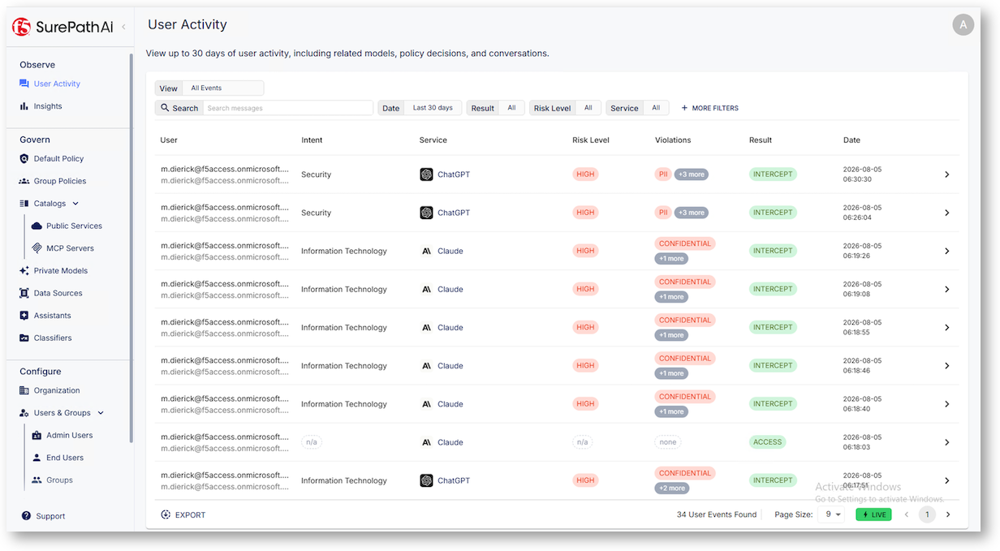
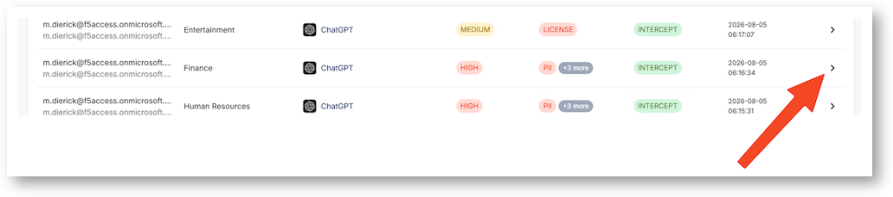
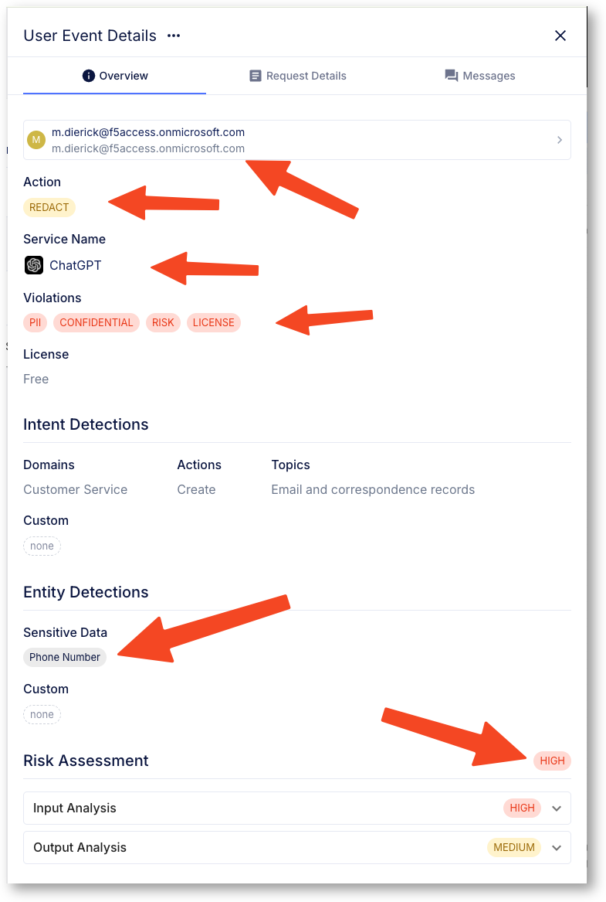
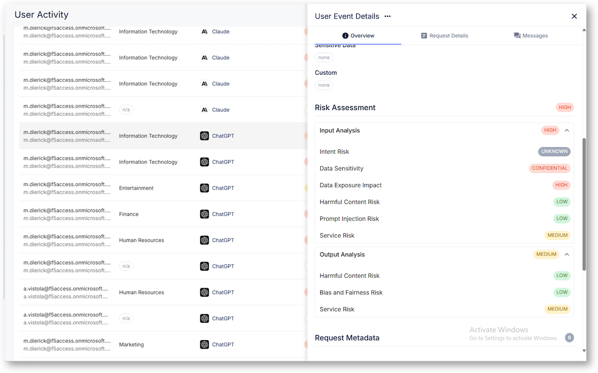
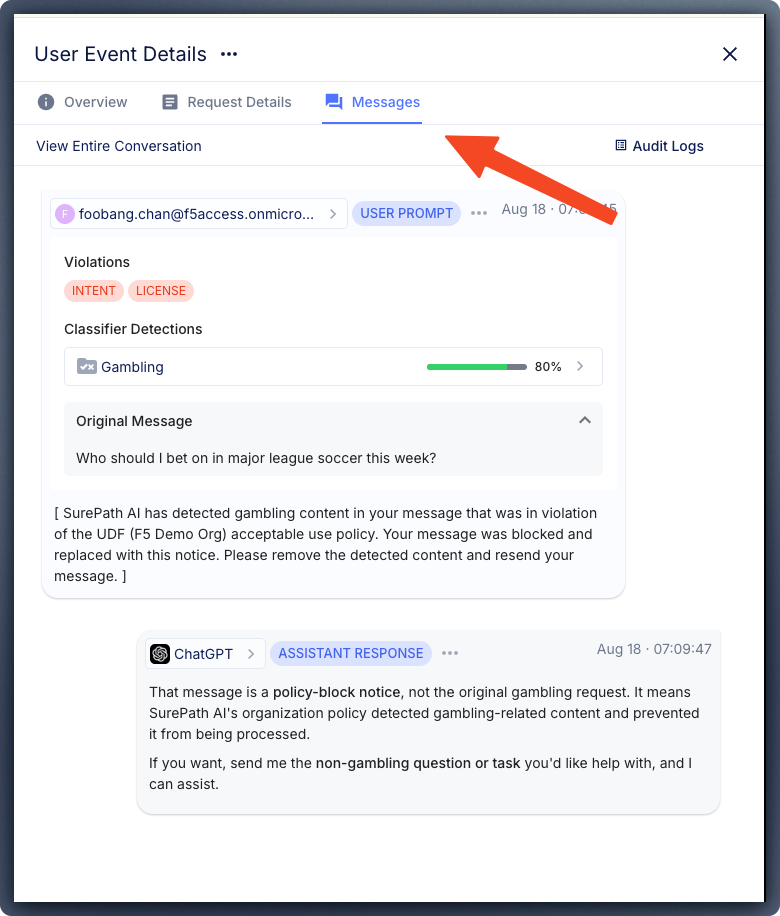
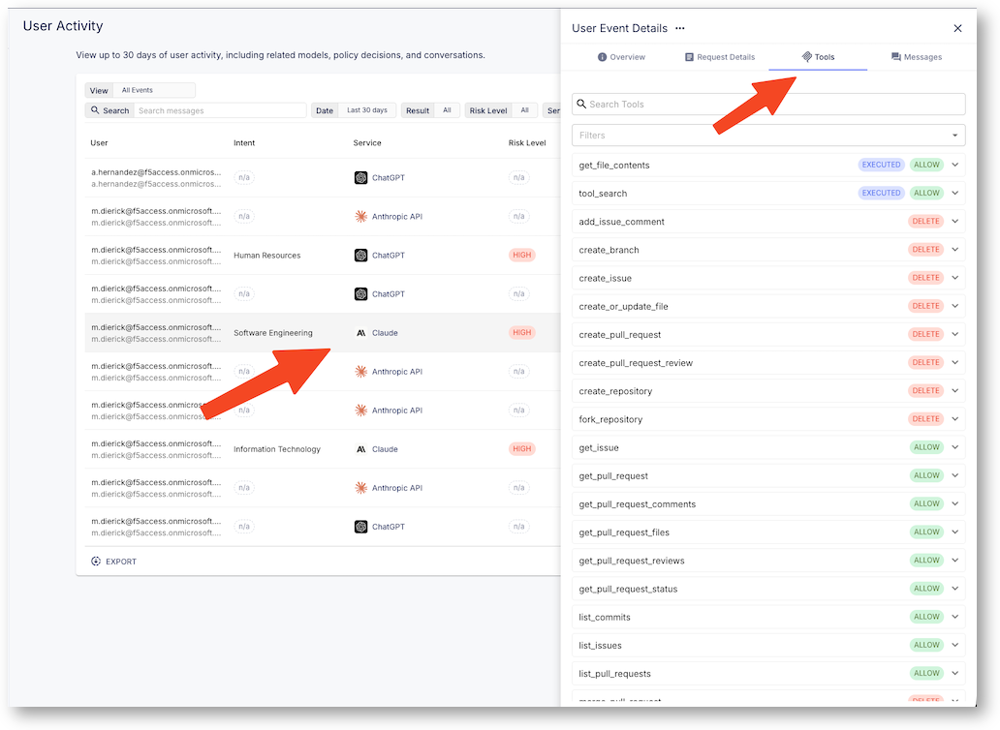
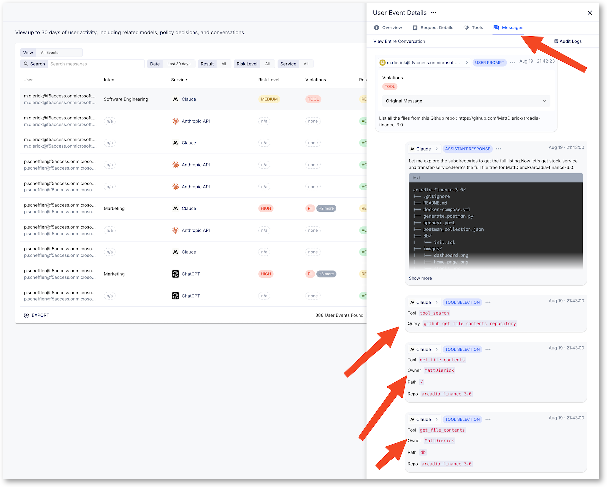

Check and learn from the user activity logs
===========================================

* In Chrome, click on F5 AI Usage Controls Admin Portal - No Login required, SSO done
* On the left menu, click on ``User Activity``. You can see all prompts

You can see all the requests from all the users of this tenant (WW F5ers). 

.. note:: Some requests can have ``Intent`` or other categories to N/A, no worries, this is due to the Powershell script simulating your user identity. Discard them.

* Select one prompt, and click on the right arrow, to pop out the new window with the details

* Navigate into the details and check the warning and logs. Navigate and click on the different menus to analyser deeper the prompt and the response.

.. note:: Don't forget to click on the Message tab to see the prompt and the response. If the prompt has been REDACT, you can see the original, what's more you can see also the ``Classifier`` ...

* For the MCP Demo, when you send the prompt with Claude Desktop with the Github MCP server, find the request in the list and click on the details.

You can see a new tab ``Tools``. These are the MCP tools that are running on the MCP server. 

Click on the message to see the tools used with the prompt.

