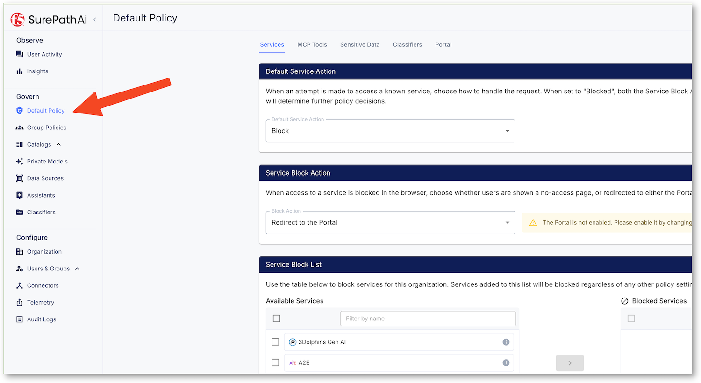
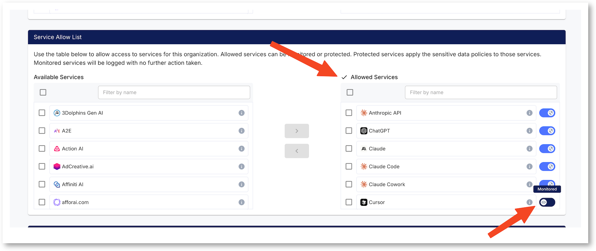
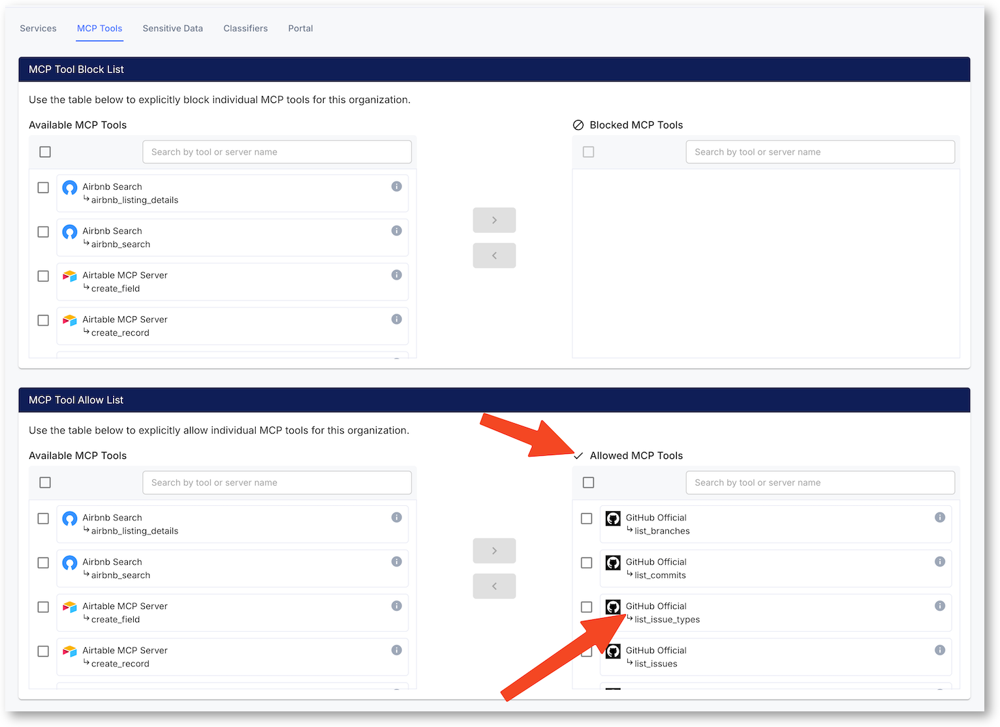
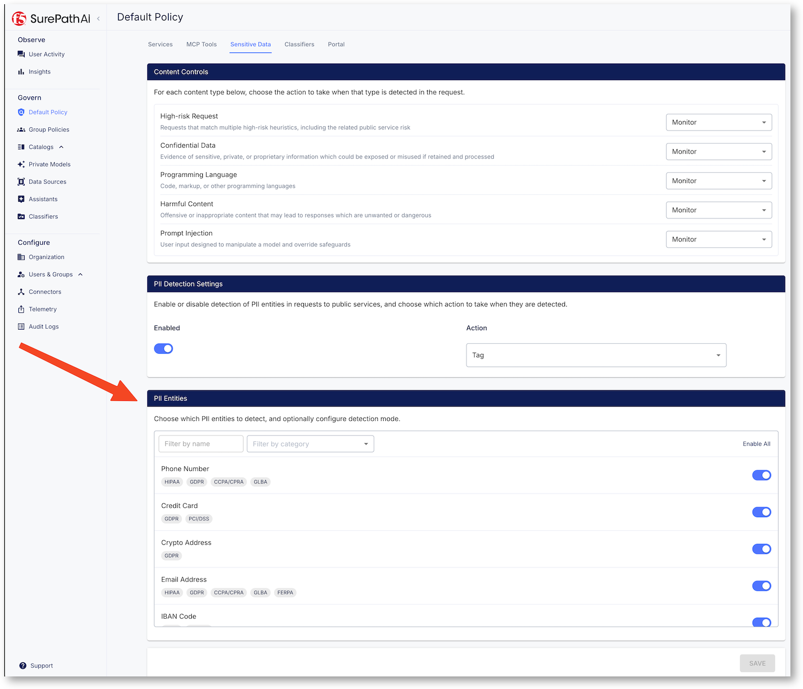
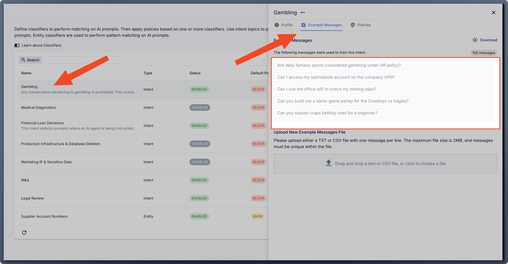

Check and learn the policy applied
==================================

* In Chrome, click on Surepath Admin Portal - No Login required, SSO done
* On the left menu, click on ``Default Policy``. 

* You can start by the ``Services`` tab, and check the services that are enabled and allowed. As you can see a service can be allowed but in Monitoring mode, meaning no action is taken, only monitoring and logging.

* In the MCP Tools tab, check the tools allowed. You can see we only allow ``Github`` with ``List`` tools.

* In the ``Sensitive Data`` tab, you can see the sensitive entities enabled.

* The ``Classifiers`` are set in 2 separated sections. The intent is set on the left menu and the classifiers are enabled into the policy. As you can see, 4 classifiers are enabled in blocking mode.

.. image:: ../../pictures/classifiers-menus.png

* Click on the left menu ``Classifiers`` to see the list of classifiers and select one by clicking on the right arrow.

  * You can see that 100 messages has been added to learn the Classifier on what to detect.

